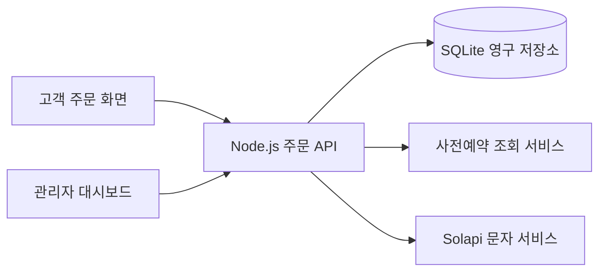

# 반쎄오갱끼데스까 주문 시스템

축제 부스에서 현장 주문과 사전예약 주문을 하나의 조리 대기 목록으로 관리하는 웹 애플리케이션입니다. 고객은 주문번호를 발급받고, 직원은 결제 확인부터 조리·수령·환불까지 관리자 대시보드에서 처리합니다.

## 시스템 구조

React 고객 화면과 관리자 화면이 같은 Node.js 서버의 API를 사용합니다. 운영 서버는 빌드된 웹 화면과 API를 함께 제공하며, 주문은 SQLite에 저장합니다. 외부 사전예약 서비스와 문자 서비스는 서버에서만 호출합니다.



| 영역 | 기술과 역할 |
| --- | --- |
| 화면 | React 19, TypeScript, Vite, Tailwind CSS |
| API | Node.js 22 HTTP 서버, 개발 환경에서는 Vite 미들웨어 |
| 저장 | Node.js 내장 SQLite, 트랜잭션과 WAL 모드 |
| 관리자 인증 | 서버 세션과 HttpOnly 쿠키 |
| 문자 | Solapi 요청 및 발송 결과 조회 |
| 배포 | 프런트엔드·서버 번들 빌드, Railway 단일 인스턴스 |

## 고객 주문 흐름

현장 운영에서 발견한 병목, 관리자 재발송·전화번호 조회의 필요성과 대기시간 안내를 단순화한 이유는 [현장 운영 개선 기록](docs/field-operation-changes.md)에 정리했습니다.

### 현장 주문

1. 상품과 수량을 확인하고 주문을 시작합니다.
2. 전화번호를 입력한 뒤 별도의 개인정보 수집·이용 동의 화면에서 동의합니다.
3. 다음 입금 안내 화면에서 계좌·QR·금액을 확인하고 주문 접수하기를 누르면 접수 후 처음 화면으로 돌아갑니다. 개인정보 동의와 입금 안내는 각각의 화면이며, 추가 최종 확인·접수 완료 화면은 없습니다.
4. 직원이 부스에서 실제 결제를 확인한 뒤 조리중으로 전환합니다.
5. 조리와 준비가 끝나면 직원이 주문번호를 확인하고 수령 완료 처리합니다.

전화번호와 동의는 현장 주문의 필수 항목입니다. 도메인은 문자 알림과 주문번호 안내를 지원하며, 현재 신규 주문 화면은 문자 알림을 사용하는 흐름으로 연결됩니다. 웹 주문 접수 자체가 결제를 수행하지는 않습니다.

### 사전예약 접수

고객이 수령코드를 입력하면 서버가 외부 예약 서비스에서 예약 수량, 입금 확인 여부, 수령일을 조회합니다. 입금 확인이 완료되고 한국 시간 기준 당일 수령하는 예약만 결제 완료·조리중 주문으로 접수합니다. 수량과 가격은 서버에서 결정하며, 고객 입력으로 바꿀 수 없습니다.

예약 식별자를 기준으로 중복 접수를 방지합니다. 같은 예약을 다시 접수하면 기존 주문을 반환하며, 이력을 삭제한 예약은 다시 주문을 만들 수 없습니다. 사전 확보한 예약 물량은 현장 판매 재고에서 차감하지 않습니다.

### 접수 중단과 재개

관리자 대시보드에서 판매를 중단하면 현장 주문과 새 사전예약 접수를 함께 막습니다. 고객 화면의 예약 접수 버튼도 비활성화되며, 이미 입력 화면에 들어온 고객의 새 접수는 서버에서도 차단합니다. 판매를 재개하면 다시 접수할 수 있습니다. 기존 주문은 계속 처리할 수 있습니다.

## 관리자 운영

관리자 화면의 부스 이름을 클릭하면 주문 현황으로 돌아갑니다. 별도의 운영설정 화면 없이 대시보드에서 판매 중단·재개를 제어합니다.

| 주문 상태 | 의미 |
| --- | --- |
| 결제 확인 | 현장 결제를 기다리는 주문 |
| 조리중 | 결제 확인이 완료된 주문 또는 접수된 사전예약. 이 상태에서 바로 수령 완료 처리 |
| 수령 완료 | 고객에게 전달된 주문 |
| 취소 | 직원이 취소한 주문 |
| 자동취소 | 결제 제한 시간이 설정된 경우 기한을 넘긴 주문 |

기본 운영에서는 결제 제한 시간을 사용하지 않으며, 결제 대기 주문은 직원이 확인하거나 취소합니다. 취소를 확인하면 결제 여부와 관계없이 주문 목록·이력에서 삭제되고 금액·수량 집계에서 제외됩니다. 환불 대기는 생성하지 않습니다. 결제 확인 전 재고를 확보한 주문은 취소 시 재고를 복구하며, 조리중 주문은 복구하지 않습니다. 삭제된 요청과 예약의 중복 접수는 계속 차단합니다. 이전 운영에서 이미 생성된 환불 필요 기록은 기존 방식으로 처리할 수 있습니다. 시스템이 결제나 환불을 직접 실행하지는 않습니다.

수령완료 카드에서 처리 완료·내역으로 이동을 누르면 대시보드에서 제외하고 처리 완료 시각을 기록합니다. 주문 정보와 처리 이력은 삭제하지 않으며 전체 주문 이력에서 처리 완료 상태로 확인할 수 있습니다. 대기 중인 문자는 계속 처리합니다.

전체 주문 이력은 모든 운영의 기록을 기본으로 보여주며, 한국 시간 기준 주문 날짜로 자동 구분합니다. 날짜별 조회와 주문 상태·주문번호·전화번호 검색을 지원합니다. 전화번호는 하이픈이나 공백을 포함해 검색할 수 있습니다. 날짜를 선택하면 해당 날짜의 건수·수량·금액도 함께 집계합니다. 날짜를 구분하기 위해 운영 시작·종료 버튼을 누를 필요가 없습니다.

주문 상세에서는 상태 변경 이력과 처리 시각을 확인할 수 있습니다. 완료·취소·만료된 주문 중 환불이나 문자 처리가 남아 있지 않은 주문은 확인 후 이력을 삭제할 수 있습니다. 삭제된 주문은 집계와 고객 조회에서 제외됩니다.

## 중복 접수와 동시 처리

- 현장 주문은 요청 식별자와 제출 내용을 함께 기록합니다. 같은 요청의 재시도는 기존 주문을 반환하고, 같은 식별자로 내용을 바꾸면 거부합니다.
- 브라우저는 응답이 불명확한 제출을 `sessionStorage`에 보관하고, 재시도 전에 서버의 기존 접수 결과를 조회합니다.
- 주문·재고 변경과 예약 중복 확인은 SQLite 트랜잭션 안에서 처리합니다.
- 관리자 변경 요청에는 버전을 포함해 다른 직원이 먼저 처리한 주문이나 판매 상태를 덮어쓰지 않습니다.
- 고객 결과 화면과 관리자 화면은 주기적으로 서버를 조회해 상태를 갱신합니다.

## 문자 안내

문자를 사용하는 주문을 결제확인에서 조리중으로 변경하면 결제 접수 안내 문자를 발송합니다. 문자는 주문번호, 결제금액과 CU 편의점 앞 수령 장소를 안내합니다. 기본 흐름은 결제확인 → 조리중 → 수령완료이며 별도 준비 완료 단계는 없습니다. 조리중 주문을 수령완료로 변경하면 두 번째 픽업 안내 문자를 자동 발송합니다. 별도의 조리 완료 문자 보내기 버튼은 없습니다. 결제 문자가 처리 중이면 그 처리가 끝난 뒤 픽업 문자를 발송하며, 같은 조리 완료 요청은 중복 발송하지 않습니다. Solapi 접수와 통신사 발송 완료를 구분하고, 발송 실패와 결과 불명확 상태를 관리자에게 표시합니다. 결과가 불명확한 문자를 자동으로 다시 보내지 않으며, 직원이 확인 후 재안내할 수 있습니다.

문자 설정이 없어도 주문 처리는 가능하지만 문자 발송은 실행되지 않습니다. 개발 및 테스트에서는 가상 데이터와 모의 전송을 사용합니다.

## 데이터와 보안

관리자 API는 인증된 서버 세션을 요구하며, 변경 요청의 출처와 입력 형식을 검증합니다. 전화번호는 서버 저장 시 AES-256-GCM으로 암호화합니다. 인증된 관리자 주문 조회에서는 전체 전화번호를 제공하고, 고객 응답에서는 마스킹된 번호만 제공합니다. 관리자 주문 카드·상세·문자 안내·전체 주문 이력에서 전체 번호를 확인할 수 있습니다. 전화번호가 없는 사전 예약 주문은 미등록으로 표시합니다. 예약 API 인증키와 문자 서비스 자격 증명은 브라우저로 전달하지 않습니다.

비밀번호, API 키, 암호화 키, 실제 고객 데이터, 데이터베이스와 로컬 검증 자료는 저장소에 올리지 않습니다. 운영 자격 증명은 배포 환경의 변수로 관리합니다.

## 주요 디렉터리

```text
src/app/                 화면 라우팅과 이동
src/pages/               고객 주문·예약·결과·관리자 화면
src/features/checkout/   입력, 동의, 제출 기록과 복구
src/features/orders/     고객 주문 API 클라이언트
src/features/admin/      관리자 API, 주문 카드와 전체 이력
src/components/          공통 UI와 행사 안내
src/domain.ts            주문 타입, 상품과 검증 규칙
server/orderApi.ts       고객·관리자 API 라우팅
server/orderStore.ts     주문 저장, 상태 변경과 중복 방지
server/adminAuth.ts      관리자 인증과 세션
server/reservationLookup.ts 사전예약 서비스 조회
server/solapi.ts         문자 요청과 결과 확인
server/start.ts          운영 HTTP 서버와 정적 파일 제공
tests/                   주문·인증·예약·배포 검증
public/assets/           화면 이미지와 아이콘
```

## 로컬 실행

Node.js 22와 npm을 사용합니다.

```sh
npm ci
npm run dev
```

개발 서버는 기본적으로 `http://127.0.0.1:5173`에서 실행됩니다. 환경변수는 실행 프로세스에 설정해야 하며, 서버가 `.env` 파일을 자동으로 읽지는 않습니다. 별도 DB 경로를 지정하지 않은 개발·미리보기 서버는 메모리 저장소를 사용합니다.

| 환경변수 | 용도 |
| --- | --- |
| `ADMIN_USERNAME` | 관리자 계정 이름 |
| `ADMIN_PASSWORD` | 관리자 비밀번호, 최소 16자 |
| `ADMIN_COOKIE_SECURE` | HTTPS 보안 쿠키, 로컬 HTTP에서만 `false` |
| `PHONE_ENCRYPTION_KEY` | 전화번호 암호화용 32바이트 키의 64자리 16진수 표현 |
| `ORDER_DB_PATH` | SQLite 파일 경로 |
| `ORDER_API_KEY` | 외부 사전예약 서비스 인증키 |
| `SOLAPI_API_KEY`, `SOLAPI_API_SECRET` | 문자 서비스 인증 정보 |
| `SOLAPI_SENDER_NUMBER` | 문자 서비스에 등록한 발신번호 |
| `PORT` | 운영 HTTP 포트, 기본값 3000 |

영구 DB를 사용할 때는 같은 암호화 키를 유지해야 기존 전화번호를 복호화할 수 있습니다. 관리자 비밀번호가 설정되지 않으면 관리자 API를 사용할 수 없습니다.

## 빌드와 배포

```sh
npm run build
npm start
```

`dist/`에는 화면 번들, `dist-server/`에는 서버 번들이 생성됩니다. 운영 서버는 같은 출처에서 화면과 `/api/*`를 제공하고, `/health`에서 상태를 확인할 수 있습니다.

Railway 설정은 `railway.json`에 정의합니다. SQLite를 배포 후에도 유지하려면 영구 볼륨에 저장해야 합니다. `ORDER_DB_PATH`를 지정하지 않으면 볼륨 경로 또는 `data/` 아래에 DB를 생성합니다. 현재 구조는 SQLite 파일과 메모리 관리자 세션을 사용하는 단일 인스턴스를 전제로 하며, 서버가 재시작되면 관리자는 다시 로그인합니다.

GitHub에 코드를 푸시하는 것과 운영 서버에 배포하는 것은 별도 작업입니다. GitHub 자동 배포는 Railway에서 저장소와 브랜치를 연결한 경우에만 동작합니다.

## 검증

관리자 예상 대기시간은 주문 접수부터 첫 조리 완료 또는 수령 완료 처리까지의 기록을 학습합니다. 주문 수량과 접수 당시 앞선 미완료 수량을 입력으로 사용하는 비음수 가중 회귀 모델이며, 최근 처리 기록에 더 높은 가중치를 부여합니다. 최신 80건을 이용하고 완료 기록 변경 시 서버에서 재학습하며 관리자 조회는 5초마다 예측을 갱신합니다. 모델은 암호화된 주문 저장소의 시간·수량 기록으로 재구성되므로 재시작 후에도 학습 기록이 유지됩니다. 별도 외부 AI 서비스로 고객 정보를 전송하지 않습니다.

완료 기록이 3건 미만이면 숫자를 표시하지 않습니다. 관리자 화면에는 신규 주문 기준으로 “지금 주문하면 약 10분”처럼 대표 예상 시간 한 문장만 표시합니다. 5분 단위로 안내하고 5분 이하는 1분 단위로 표시합니다. 주문별 예상 시간이나 시간 초과 안내는 표시하지 않습니다. 내부 예측 범위와 검증 오차는 API에 유지하며, 표시를 단순화하는 것 자체가 예측 정확도를 높이지는 않습니다.

각 신규 주문에는 접수 당시 모델 예측을 서버 내부에 저장하며, 완료 후 실제 소요시간과 비교한 운영 평균 오차를 최근 20건으로 집계합니다. 접수 당시 예측은 고객 응답에 포함하지 않습니다. 과거 평균 오차는 각 접수 시점 이전에 완료된 기록만 사용한 순차 검증이며, 같은 주문들에 대해 최근 10건 단순 평균의 오차도 내부 집계합니다. 모델의 기존 최근성 반감기 120분은 유지합니다. 실제 조리가 끝나는 시점에 완료 버튼을 눌러야 준비 시간 예측을 학습할 수 있습니다. 완료 버튼을 실제 고객 수령 시점에 누르면 그 지연도 학습에 포함됩니다. 취소·삭제한 기록은 학습과 운영 오차 집계에서 빠집니다.

```sh
npm run typecheck
npm test
npm run test:api
npm run test:operations
npm run test:wait
npm run test:reservation
npm run build
npm run test:admin
npm run test:deploy
```

API 테스트는 별도 실행 중인 로컬 서버를 사용합니다. `npm run dev`를 먼저 실행하면 기본 주소에 연결하며, 다른 로컬 포트는 `TEST_API_URL`로 지정합니다. 관리자·배포 테스트는 빌드된 서버를 사용합니다. 테스트는 로컬 서버와 임시 저장소를 사용하며 실제 결제나 실제 문자 발송을 수행하지 않습니다.
